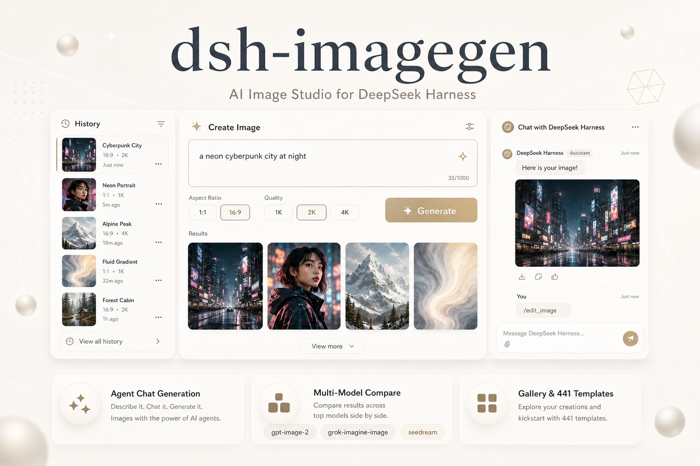
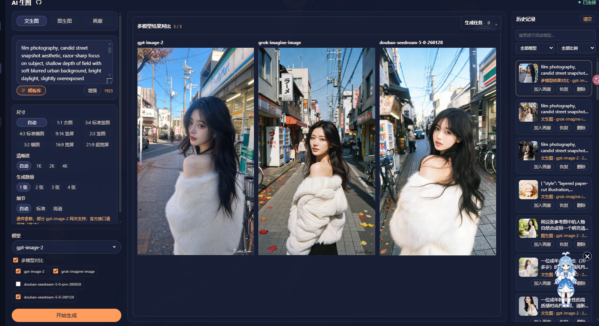
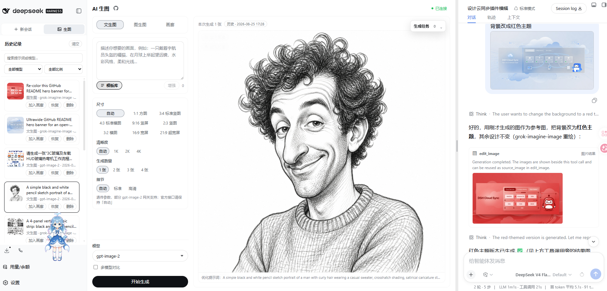
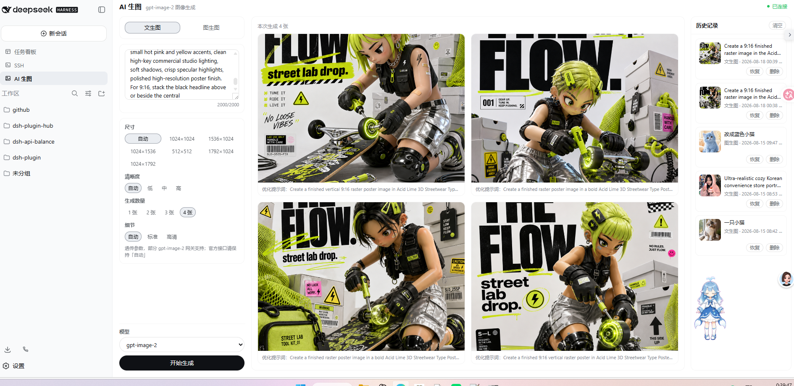
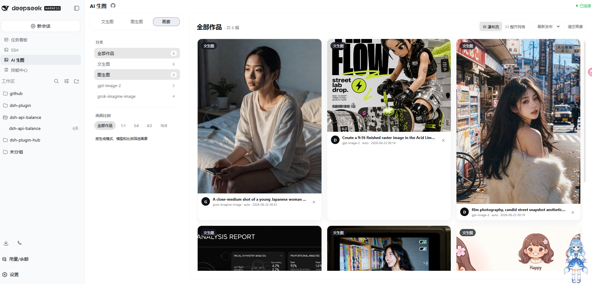
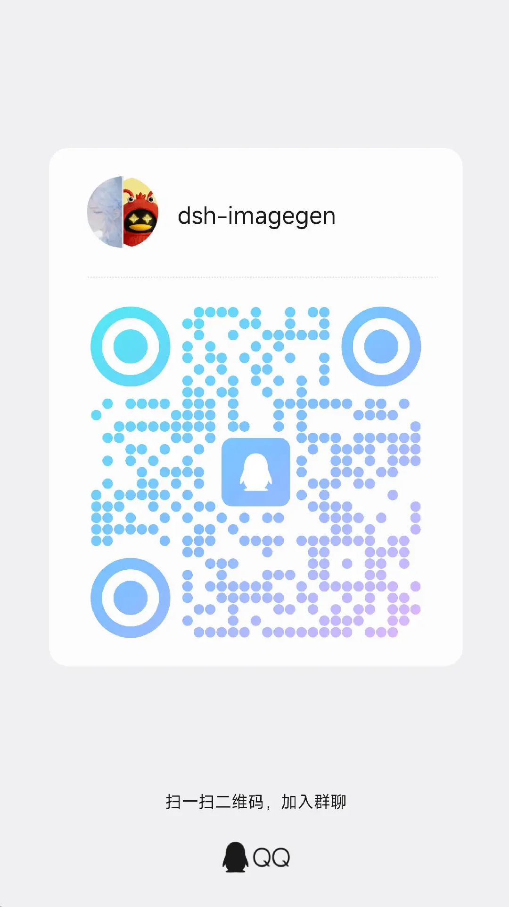

# dsh-imagegen

[](https://www.npmjs.com/package/@dickpy/dsh-imagegen)
[](./LICENSE)
[](https://github.com/dickpy/dsh-imagegen)

<p align="center">
  
</p>

> 让 DeepSeek Harness 中的 Agent 不只会回答，还能把想法变成图片，并围绕成图继续迭代。

`dsh-imagegen` 是 DSH 的原生 AI 图像工作台。它把可配置的 OpenAI 兼容生图接口、Agent 工具调用、后台任务、文生图、图生图、多模型比较和作品管理放进同一条工作流。你不需要在生成期间守着界面，也不需要把图片在多个工具之间来回搬运。

**核心路径：** 配置图片模型 → 生成图片 → 加入对话或画廊 → 用 Agent 或 `/edit_image` 连续修改。

<p align="center">
  <strong>
    <a href="#quick-start">快速开始</a>&nbsp;&nbsp;&nbsp;|
    <a href="#agent-workflow">Agent 对话生图</a>&nbsp;&nbsp;&nbsp;|
    <a href="#model-comparison">多模型对比</a>&nbsp;&nbsp;&nbsp;|
    <a href="#studio">原生工作台</a>
  </strong>
  <br />
  <strong>
    <a href="#gallery">画廊管理</a>&nbsp;&nbsp;&nbsp;|
    <a href="#configuration">配置模型</a>&nbsp;&nbsp;&nbsp;|
    <a href="#community">交流群</a>
  </strong>
</p>

<a id="what-it-solves"></a>
## 功能速览

| 目标 | 直接用法 | 得到什么 |
| --- | --- | --- |
| 快速生图 | 在工作台输入提示词，选择模型、比例和清晰度 | 文生图结果、任务状态和历史记录 |
| 对话生图 | 在 DSH 对话中描述画面，让 Agent 调用 `generate_image` | 图片作为工具结果显示，不打断对话 |
| 连续编辑 | 从预览区或画廊点击“加入对话”，输入 `/edit_image 修改内容` | 直接调用插件图片模型进行图生图 |
| 并行探索 | 选择多个已配置模型，开启多模型对比 | 相同参数下的并列结果 |
| 沉淀资产 | 将满意结果加入画廊，搜索、打标签、批量下载 | 可持续管理的图片资产 |

<a id="agent-workflow"></a>
## Agent 对话生图与连续编辑

这是插件的核心体验。开启“允许 Agent 调用生图”后，直接在 DSH 对话中说出你想要的画面即可。Agent 会从已允许的模型中选择合适项，提交任务并等待完成；真实图片会显示在工具调用对应的左侧结果区域，模型收到状态和附件引用，不会额外产生一条用户消息。

接着，你可以基于结果继续提出修改。Agent 会携带该图片的引用调用图生图，不必重新上传文件，也不必重新描述全部上下文。它适合快速探索视觉方向、反复打磨 UI 视觉稿、海报或产品素材。

<p align="center">
  <a href="https://raw.githubusercontent.com/dickpy/dsh-imagegen/main/docs/videos/agent-chat-edit.mp4">
    
  </a>
  <br />
  <a href="https://raw.githubusercontent.com/dickpy/dsh-imagegen/main/docs/videos/agent-chat-edit.mp4">点击播放 Agent 对话生图与连续编辑演示视频</a>
</p>

点击封面或下方链接即可打开视频。视频展示了从生成预览区或画廊把图片加入对话，再使用 `/edit_image` 调用插件图片模型继续修改的完整流程。

### 可直接使用的案例提示词

**第一轮：让 Agent 生成一张项目海报**

```text
帮我为 dsh-imagegen 设计一张 16:9 横版项目海报。深色未来感背景，青蓝和紫色霓虹光效；画面中心展示 AI 生图工作台，包含赛博城市、人物肖像、雪山和抽象流体四张示例图；下方展示 Agent 对话生图、多模型对比和画廊三个能力区。整体干净、专业、有产品发布感，不要杂乱的小字。
```

**第二轮：基于刚才的成图继续修改**

```text
保留当前海报的整体构图和深色科技风。把中心的赛博城市替换成更明亮的夜景，增强青蓝与紫色的边缘光；底部“Agent 对话生图”区域更突出，其他两项保持弱一级。不要重新生成一张完全不同的海报。
```

Agent 会把上一轮图片作为参考图提交图生图任务，因此第二轮只需要描述变化，而不必再次上传图片或重复全部需求。

**对话中可用的能力**

| 工具 | 用途 |
| --- | --- |
| `generate_image` | 提交文生图任务，默认等待完成后在左侧工具结果显示图片，并返回附件引用；传 `wait_for_completion: false` 可改为后台模式。 |
| `get_image_generation_task` | 查询任务；完成时在左侧工具结果显示图片，并返回下一步编辑所需的图片引用。 |
| `edit_image` | 以已有图片为参考提交图生图任务，默认等待完成后在左侧工具结果显示图片。 |
| `cancel_image_generation_task` | 取消排队中或正在执行的任务。 |

如果当前对话模型不支持图片输入，可直接使用宿主命令绕过这项检查：先上传图片（或将生图预览区、画廊图片加入对话），再输入 `/edit_image 把背景改成夜景`。加入对话的图片会先作为当前会话的插件附件暂存，命令直接调用插件配置的图片模型，完成后可在 AI 生图面板查看结果；它不会把图片或命令再次发送给对话模型。

**从图片到编辑的最短路径**

1. 在生图预览区或画廊点击“加入对话”。
2. 在右侧对话输入 `/edit_image`，后面写明修改内容，例如 `/edit_image 把背景改成夜景`。
3. 命令会直接调用插件配置的图片模型，图片不会经过对话模型的图片能力判断。

未配置 API 地址、密钥或可用生图模型时，工具会明确引导到 DSH 的“设置 → 插件 → AI 生图”，而不是静默失败。Agent 调用默认开启，也可按需关闭，仅保留侧边栏工作台。

<a id="model-comparison"></a>
## 多模型并列对比

同一个提示词往往在不同模型上呈现出完全不同的构图、质感与文字处理。打开“多模型对比”，选择多个已配置模型后，插件会以相同参数提交任务，并在画布和全屏预览中将结果并列展示。这样能更快选出真正适合当前任务的模型，而不是凭感觉反复试错。



<a id="studio"></a>
## 原生图像工作台

点击“新会话 / 生图”中的“生图” Tab 后，工作区按“历史记录 | 生图区 | AI 对话”排列。历史记录独立显示在左侧，生图参数和结果集中在中间，对话区独立显示在右侧；拖动两区之间的分隔线即可让对话区更宽或更窄。画廊模式仍保留左侧历史记录，点击历史记录会回到文生图并载入对应图片。文生图和图生图均支持尺寸、清晰度、数量与细节等级；结果可下载、全屏查看、缩放、前后切换、复制提示词、加入对话，或一键作为下一次图生图的参考。左侧历史区和结果预览区均可收起，便于专注查看大图。





**让首次生成更可控**

- 提示词增强可检测当前 API 支持的对话模型，把一句简短想法扩写成更完整的生图提示词。
- 生成任务由宿主进程排队执行，支持查看状态、取消和失败重试，长任务不会卡住整个面板。
- 历史记录保留提示词、模型与参数，支持关键词、模型和比例筛选；最多保存 50 条最近记录。
- 内置 441 个 `gpt-image-2` 提示词案例，可搜索、筛选、复制并一键回填。

<a id="gallery"></a>
## 画廊：把生成结果变成可用资产

满意的图片可从结果卡、全屏预览或历史记录一键加入画廊；画廊中的图片也可以直接加入当前对话，再用 `/edit_image` 修改。画廊不是横向缩略图条，而是为持续积累作品设计的纵向工作区：左侧筛选，右侧瀑布流或整齐网格，点击任意图片即可打开大图预览。



- 关键词搜索，按生成模式、模型、比例和自建标签过滤。
- 标签可新建、编辑和删除；标签入口会同步出现在左侧筛选区。
- 多选图片后可批量下载，或导出 JSON 元数据作为备份。
- 收藏由 DSH 宿主持久化保存，跨同一宿主的浏览器/设备可见，同一图片内容不会重复加入。

<a id="quick-start"></a>
## 快速开始

前置条件：已安装 [DeepSeek Harness](https://github.com/deepseek-ai/DeepSeek-Harness) 和 Node.js 20+。安装完成后重启 `dsh web`，侧边栏的“新会话”入口会显示“新会话 / 生图”双 Tab。首次使用只需要配置一个图片模型；想让 Agent 自动生图，再打开“允许 Agent 调用生图”。

### 一条命令安装

```bash
dsh plugin --profile web add @dickpy/dsh-imagegen
```

Windows 如遇 PowerShell 脚本策略限制，请使用 `dsh.cmd`。安装后点击“生图” Tab 进入工作区；配置仍在“设置 → 插件 → AI 生图”中，填写 API 地址和密钥，检测并选中可用模型后保存。

### 让 Agent 帮你安装

将下面内容直接发给 DSH、Codex 或其他 coding agent：

```text
用 dsh plugin --profile web add @dickpy/dsh-imagegen 安装 AI 生图插件。完成后重启 dsh web，点击“新会话 / 生图”中的“生图” Tab，并打开设置中的 AI 生图配置。
```

### 从 Release 安装

从 [GitHub Releases](https://github.com/dickpy/dsh-imagegen/releases) 下载目标版本的 tgz 后执行：

```bash
dsh plugin --profile web add <下载路径>/dickpy-dsh-imagegen-<版本号>.tgz
```

### 升级与回滚

已通过 npm 安装的用户，可以重复执行上面的 `add` 命令获取最新版；升级后请重启 `dsh web`。如果需要固定版本，可使用 `@dickpy/dsh-imagegen@<版本号>` 或指定 Release tgz。插件的渠道配置、历史记录和画廊数据由 DSH 宿主保存，正常升级不会清空；如需回滚，请安装目标版本并再次重启宿主。

<a id="configuration"></a>
## 配置模型

打开 DSH 的“设置 → 插件”，展开 **AI 生图（dsh-imagegen）**，先添加一个提供方。每个提供方都有独立的 API 地址、密钥和模型目录，可同时配置多个服务。

| 配置项 | 如何使用 |
| --- | --- |
| 提供方 | 预置提供方可直接选择；也可以添加自定义渠道。 |
| API 地址 | OpenAI 兼容接口根地址，例如 `https://api.openai.com/v1`。插件会自动追加图像接口路径。 |
| API 密钥 | 每个提供方单独配置，密钥仅保存在 DSH 宿主侧，浏览器与 Agent 都不会获得明文。 |
| 模型目录 | 保存地址和密钥后点击“检测可用模型”；检测结果会优先过滤聊天、Embedding 等非图片模型，再勾选实际支持生图的项目。没有 `/models` 的网关可手动添加，并可设置显示别名。 |
| 提示词增强模型 | 可选。点击“获取可用模型”，选择支持 `/chat/completions` 的模型；通常可复用生图 API 凭据。 |
| 允许 Agent 调用生图 | 默认开启。关闭后，Agent 不能提交、查询和取消任务，侧边栏工作台不受影响。 |

> `/models` 的标准响应通常不含“是否支持生图”的能力字段，因此插件会结合能力字段和模型 ID 做候选过滤，但仍不是兼容性认证。请只选择你的上游实际支持的生图模型。

### 已适配的接口

- **OpenAI 兼容接口**：支持 `/images/generations`、`/images/edits` 和 `{ data: [{ b64_json | url }] }` 格式响应。
- **智谱 GLM-Image**：内置 `glm-image`，官方地址使用 `https://open.bigmodel.cn/api/paas/v4`，文生图走 `/images/generations`，质量参数映射为 `hd`；当前不支持图生图。
- **Grok Imagine**：原生支持 `grok-imagine-image` 与 `grok-imagine-image-2.0`。将地址设为 `https://api.x.ai/v1` 后，图生图会使用其 JSON `image_url` 协议，比例和清晰度映射为 `aspect_ratio` 与 `resolution`。
- **Nano Banana（谷歌 Gemini 图像系列）**：内置 `nanobanana2` / `nanobanana2-lite` / `nanobanana-pro`（也识别官方 `gemini-3.x-image*` ID）。走 OpenAI 兼容接口时，比例和清晰度映射为 `aspect_ratio` 与 `image_size`（1K/2K/4K），输出请求 base64。
- **Seedream（字节跳动生图系列）**：内置 `seedream-5.0-pro`（也识别 `seedream-4.x`、`doubao-seedream-…`）。无 `/images/edits`，文生图与图生图统一走 `/images/generations`，参考图以 JSON `image` 数组发送；官方 Ark 接口的 `size` 用于清晰度档位（1K/2K，5.0-pro 上限 2K），面板比例不会误传为 Ark 的 `size`。
- **后续模型**：没有被检测规则识别的 OpenAI 兼容图片模型仍可手动加入清单；厂商专属鉴权或请求协议需要单独适配。

<a id="community"></a>
## 交流群

欢迎加入 QQ 群，一起交流 DSH、AI 生图和插件使用体验，也欢迎分享提示词、工作流与改进建议。

<p align="center">
  
</p>

<a id="security"></a>
## 数据与安全

- API 请求由 DSH 宿主进程代理，浏览器不直接连接上游，因此没有 CORS 问题，也不会暴露 API 密钥。
- 密钥保存于本机 DSH 设置中，设置页面仅展示“已配置”状态。
- 历史、画廊和图片数据保存在宿主的 `~/.dsh/dsh-imagegen/`，由你控制；画廊图片按内容去重。
- 模板库随插件发布提示词快照，展示图通过宿主同源代理按需拉取与缓存。
- 图生图会把参考图发送到当前渠道配置的上游 API；请确认渠道服务商的数据处理政策，不要上传敏感图片。
- 生图会消耗上游 API 额度。图片内容由上游模型生成，可能出现不准确、不适宜或不符合预期的结果，请在使用前进行人工检查。
- API 密钥属于敏感信息，请不要提交到 GitHub Issue、日志、截图或 README；发现密钥泄露时应立即在上游服务商处轮换。

<a id="development"></a>
## 开发与反馈

```bash
pnpm run typecheck
pnpm run build
pnpm run watch
node scripts/smoke.mjs
```

- 发现问题请提交 [Bug 报告](https://github.com/dickpy/dsh-imagegen/issues/new?template=bug_report.yml)，附带插件版本、DSH 版本和复现步骤。请勿粘贴 API 密钥。
- 有改进想法请提交 [功能建议](https://github.com/dickpy/dsh-imagegen/issues/new?template=feature_request.yml)。
- 查看全部 [Release](https://github.com/dickpy/dsh-imagegen/releases) 和 [Issue](https://github.com/dickpy/dsh-imagegen/issues)。

## 许可证

[Apache-2.0](./LICENSE)
