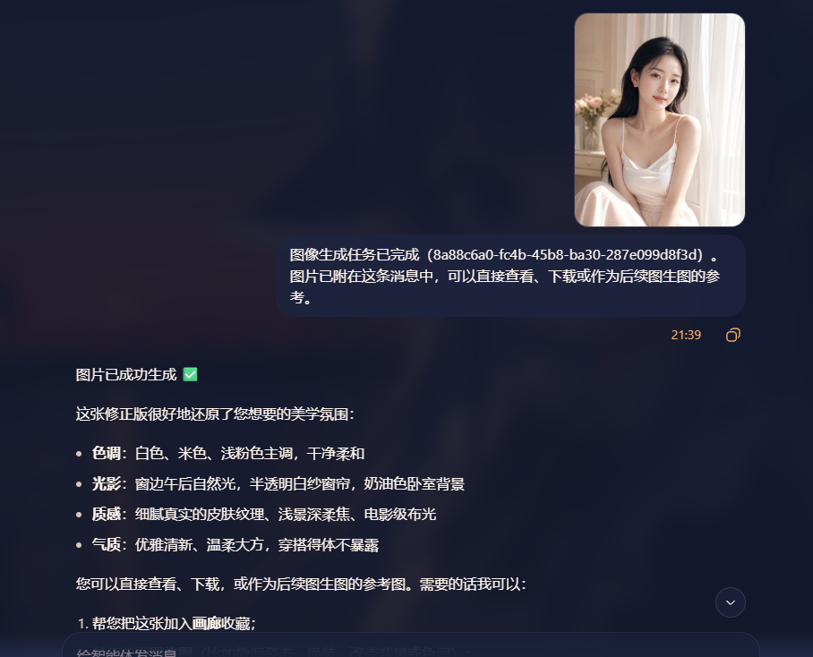
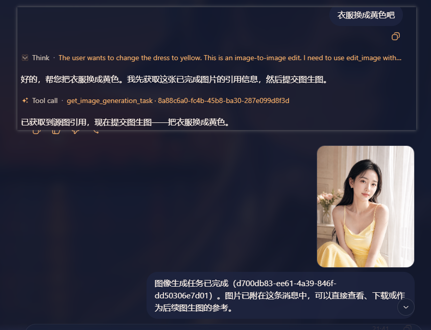

# dsh-imagegen

[](./LICENSE)
[](https://nodejs.org/)
[](https://github.com/dickpy/dsh-imagegen)

DeepSeek Harness (DSH) Web GUI 的 AI 生图工作台。它通过宿主进程安全地代理 OpenAI 兼容的图像生成接口，把提示词增强、文生图、图生图、后台任务、多模型对比、历史记录与画廊管理放进同一个 DSH 原生界面。

> 首次安装预置 `gpt-image-2` 与 xAI `grok-imagine-image`（Grok Imagine）。在设置中可从 API 的 `/models` 检测候选模型并选择实际可用项，也可手动添加任何兼容 `/images/generations` 与 `/images/edits` 的 OpenAI 风格生图模型。

## 效果预览

### AI 生图工作台

三栏工作台将参数、生成结果和历史记录放在同一视图中。任务提交后可继续操作；生成的图片可预览、下载，并从历史记录恢复参数。

**四图结果布局**


**单图结果布局**


### 多模型并列对比

打开「多模型对比」后，为同一提示词勾选多个模型。任务会进入后台队列，完成后在画布中并列展示，支持进入全屏对比，直观看出不同模型在构图、质感与文字处理上的差异。


### 提示词模板库

模板库提供 441 个 `gpt-image-2` 案例的展示图、分类筛选和完整提示词；打开详情后可以复制提示词，或一键回填到生图输入框。


### Agent 对话生图与连续编辑

开启后，直接在 DSH 对话中描述需求即可。Agent 会将任务交给后台生成，完成后把真实图片作为对话附件回贴；无需反复盯着任务状态。对结果继续说“把衣服换成黄色”之类的修改要求，Agent 会复用图片引用调用图生图，形成从想法到迭代的连续工作流。





### 画廊工作区

画廊标签页提供左侧分类筛选和右侧作品墙：可在瀑布流与整齐网格之间切换，纵向滚动浏览收藏，点击任意图片打开大图预览。支持关键词搜索、自建标签、标签筛选、批量下载与 JSON 导出。


## 功能

- **文生图与图生图**：输入提示词生成图片，或上传 PNG、JPG、WEBP 参考图进行编辑。
- **可配置生图模型**：在设置中检测 API 返回的候选模型，多选保存后，模型下拉、多模型对比、历史/画廊筛选和 Agent 调用会同步使用这份列表；不提供 `/models` 的网关可手动一行一个模型。
- **Grok Imagine 支持**：支持 xAI `grok-imagine-image` 文生图与图生图；将 API 地址设置为 `https://api.x.ai/v1` 即可使用官方比例、分辨率和 JSON 图片协议。
- **可调生成参数**：尺寸、清晰度、生成数量和细节等级均可在界面中选择；未指定的参数保持自动。
- **提示词增强**：对简短描述点击「增强」，检测当前 API 可用的对话模型后点选即可扩写为更完整的生图提示词；未配置时自动跳转到 DSH 的 AI 生图配置页。
- **后台生成任务**：生成请求提交到宿主侧队列，面板不再被单次请求阻塞；可查看排队/生成/完成状态，取消任务或重试失败任务。
- **Agent 直调生图**：默认开启。Agent 可直接用 `generate_image` 提交文生图后台任务，用 `get_image_generation_task` 取回并回贴图片附件；把返回的 `source_image` 交给 `edit_image` 即可基于生成图继续图生图，也可随时取消单个任务。
- **多模型对比**：默认关闭；开启后可勾选多个模型，以相同提示词和参数分别生成，在画布和全屏视图并列对比结果。
- **结果操作**：结果区固定为四分格：单图铺满，双图占上排，三图占三格，四图为 2×2；支持下载、全屏预览、可滚动缩放、前后切换、复制优化提示词，以及一键将当前图片添加到图生图。
- **画廊收藏与管理**：结果卡片、全屏预览与历史记录条目上都有「加入画廊」。画廊支持瀑布流/整齐网格、持续纵向滚动、关键词搜索、模式/模型/比例/标签筛选、标签编辑、批量下载与 JSON 元数据导出；收藏持久化在宿主侧 `~/.dsh/dsh-imagegen/gallery/`，无数量上限，且内容相同的图片不会重复加入。
- **可搜索历史**：保存提示词、参数和图片；支持按关键词、模型与比例筛选，查看、恢复、单条删除和清空，最多保留 50 条。
- **跨设备查看**：历史与画廊都保存在 DSH 宿主侧，连接同一 DSH 的浏览器或设备共享同一份记录。
- **提示词模板库**：提示词框左下角可打开模板库，浏览 441 个 `gpt-image-2` 案例的展示图；支持搜索、分类筛选、查看完整提示词、复制，以及一键将模板回填到生图输入框。参考图通过宿主同源代理按需加载并缓存，也可手动缓存全部图片供离线浏览。
- **原生 DSH 体验**：侧栏入口、主题适配和设置卡片均遵循 DSH Web GUI 的 UI 规范。
- **在线更新**：插件会检查 GitHub Releases，发现新版本时在工作台显示在线更新按钮；安装完成后重启 DSH 即可加载新版本。

## 快速开始

> 前置条件：已安装 DSH（`npm i -g @deepseek-ai/dsh`）与 pnpm。
> 装完统一**重启 dsh web**，侧边栏即出现「AI 生图」入口，再到「设置 → 插件 → 可配置」填写 API 地址与密钥。

### 方式一：让 AI 帮你安装（最省事）

把下面提示词直接粘贴给 **DSH**（或 Codex / 其他 coding agent）执行即可：

```text
用 dsh plugin --profile web add @dickpy/dsh-imagegen 安装 AI 生图插件（profile 名按实际修改），完成后重启 dsh web。
```

### 方式二：npm 安装（推荐）

```bash
dsh plugin --profile web add @dickpy/dsh-imagegen
```

dsh 会自动把插件注册进 profile 的 bundle 清单（无需手动改 cordis.patch.yml），重启 dsh web 即可。

### 方式三：聚合包（tarball）安装

从 [GitHub Releases](https://github.com/dickpy/dsh-imagegen/releases) 下载发布产物
（如 `dickpy-dsh-imagegen-1.2.0.tgz`），然后：

```bash
dsh plugin --profile web add <下载路径>/dickpy-dsh-imagegen-1.2.0.tgz
```

重启 dsh web。

### 方式四：源码开发启动（最后的选择）

需要改插件源码时才用这种方式：

```bash
git clone https://github.com/dickpy/dsh-imagegen.git
cd dsh-imagegen
pnpm install
pnpm run build
dsh plugin --profile web add link:/绝对路径/dsh-imagegen
```

重启 dsh web；开发时可运行 `pnpm run watch` 持续构建，bundle 变更由 client-hmr 自动热更。

## 配置 API

打开 DSH 的“设置 -> 插件 -> 可配置”，展开 **AI 生图 (dsh-imagegen)**：

| 配置项 | 说明 |
| --- | --- |
| `api_url` | OpenAI 兼容接口根地址，例如 `https://api.openai.com/v1`。插件会自动追加接口路径。 |
| `api_key` | Bearer API 密钥。界面仅显示是否已配置；输入新值可覆盖，清空后保存可删除。 |
| 允许使用的生图模型 | 先保存 API 地址和密钥，再点击“检测可用模型”，从 API 的 `/models` 返回结果勾选并保存；也可手动一行一个模型。面板、对比视图、画廊筛选和 Agent 都只使用此列表。 |
| 提示词增强模型 | 可选。检测当前 API 的候选对话模型后点选即可；通常复用生图 API 凭据。 |
| 允许 Agent 调用生图 | 默认开启。允许 Agent 提交、查询、取消生图任务并向对话回贴图片；关闭后仅保留侧边栏工作台。 |
| 启用插件 | 关闭后生图工作台不可用，设置卡片仍可用于重新启用。 |
| 向 Agent 播报 | 开启后，将插件能力写入 Agent 系统提示词。 |

`/models` 的标准响应通常不含“是否支持生图”的能力信息，因此检测结果是候选项，不是兼容性认证。请只勾选该 API 实际支持生图的模型。配置完成后，从 DSH 侧栏打开“AI 生图”即可开始使用。

## Agent 对话生图

开启“允许 Agent 调用生图”后，直接在 DSH 对话中描述想要的画面即可。Agent 会从“允许使用的生图模型”中选择模型；可明确要求某个已配置模型，未指定时默认使用列表中的第一个。Agent 会先提交后台任务，完成的图片会作为对话附件自动回贴，不会因最长 240 秒的上游生成请求卡住整个对话。需要迭代时，Agent 可以把任务结果中的 `source_image` 作为参考图调用图生图，形成“设计描述 → 生成 → 基于结果修改”的闭环。

工具名与用途：

| 工具 | 用途 |
| --- | --- |
| `generate_image` | 提交文生图任务，立即返回任务 ID。 |
| `get_image_generation_task` | 查询任务；完成时返回并回贴图片附件。 |
| `edit_image` | 使用已回贴图片的 `source_image` 提交图生图任务。 |
| `cancel_image_generation_task` | 取消排队中或正在执行的任务。 |

若 API 地址或密钥尚未配置，工具会明确提示到“设置 → 插件 → AI 生图”完成配置；API 密钥始终只由 DSH 宿主使用，不会传给 Agent 或浏览器。

## 接口兼容性

| 场景 | 请求 |
| --- | --- |
| 文生图 | `POST {api_url}/images/generations`，JSON 请求体 |
| 图生图 | `POST {api_url}/images/edits`。OpenAI 模型走 `multipart/form-data`（含 `image`、`prompt`、`model` 与参数）；Grok Imagine 模型走官方 JSON 协议（`image: { url, type: "image_url" }`，接受 base64 data URI） |
| 响应 | 支持 OpenAI 兼容的 `{ data: [{ b64_json | url }] }`；URL 图片由宿主下载并转为 base64，再返回浏览器 |

`detail` 是透传参数，部分 `gpt-image-2` 网关支持。官方 OpenAI 端点若不接受该字段，请保持界面中的“自动”。

Grok Imagine 模型（`grok-imagine-image` / `grok-imagine-image-2.0`）的请求会按官方规范发送：界面尺寸即宽高比（1:1 / 3:4 / 4:3 / 9:16 / 2:3 / 3:2 / 16:9 / 21:9），直接作为 `aspect_ratio`（21:9 映射为官方文档中的 20:9 超宽）；清晰度 1k / 2k / 4k 作为 `resolution`（官方文档当前仅支持 1k / 2k，选 4k 时自动回落为 2k）；并固定 `response_format: "b64_json"`（结果 URL 为临时签名链接，直接取 base64 更稳定）。OpenAI 兼容端点则将宽高比映射为最接近的像素尺寸（如 1:1→1024×1024、16:9→1792×1024），清晰度映射为 `quality` 档位（1k→low、2k→medium、4k→high）。API 地址填 xAI 的 `https://api.x.ai/v1` 即可使用。

未来可在模型清单中加入 `qwen-image`、Gemini 等名称，但名称出现在 `/models` 并不意味着插件已适配其原生协议。当前它们只有在上游网关同时兼容上述 OpenAI 生图路由和响应格式时才可直接使用；需要厂商专属鉴权、路径或请求体时，插件会如实显示上游错误，后续会以独立适配器支持。

## 画廊与 Grok Imagine

画廊提供独立的作品浏览工作区：左侧按生成模式、模型、画面比例和自建标签筛选，右侧以纵向瀑布流或整齐网格展示收藏图片。支持关键词搜索、标签新建/编辑/筛选、批量下载、JSON 元数据导出、发布时间排序、持续向下滚动、点击卡片打开大图预览、恢复参数、移出和清空。收藏数据由 DSH 宿主持久化到 `~/.dsh/dsh-imagegen/gallery/`，同一图片内容不会重复保存。

插件原生支持 xAI `grok-imagine-image`。将 API 地址设置为 `https://api.x.ai/v1` 后，文生图使用 `/images/generations`，图生图按 Grok Imagine 的 JSON `image_url` 协议调用 `/images/edits`；界面中的比例和清晰度会分别映射为 `aspect_ratio` 与 `resolution`。

## 数据与安全

- API 请求由 DSH 宿主进程代理，浏览器不直接连接上游 API，因此不暴露 API 密钥，也没有浏览器 CORS 问题。
- API 密钥保存在宿主侧 `~/.dsh/settings.yaml`；设置桥会对密钥进行脱敏。
- 历史与画廊数据存放在 `~/.dsh/dsh-imagegen/`：历史图片独立落盘于 `images/`（`index.json` 为索引），画廊在 `gallery/` 子目录（`gallery/index.json` 为索引，按图片内容去重）。
- 模板库的提示词快照随插件发布；展示图从 `vibeui.top` 通过本机宿主按需拉取，并缓存到 `~/.dsh/dsh-imagegen/template-images/`。模板库仅在手动刷新或首次加载展示图时访问该站点。
- 插件通过专用 loopback 路由 `/api/dsh-imagegen/settings/{describe,mutate}` 访问设置，不需要修改 DSH 源码或依赖第三方命名空间白名单。

## 项目结构

| 位置 | 职责 |
| --- | --- |
| `src/index.ts` | 插件入口、设置注册、路由挂载和 Agent 提示词播报 |
| `src/routes.ts` | `/api/dsh-imagegen/*` 宿主路由 |
| `src/engine.ts` | 上游图像生成代理与响应归一化 |
| `src/history-store.ts` | 历史记录和图片持久化 |
| `src/templates-store.ts` | 模板快照、在线刷新和展示图本地缓存 |
| `src/client/ImageGenPanel.tsx` | 生图工作台、结果、历史与大图预览 |
| `src/client/TemplateLibrary.tsx` | 模板图库、搜索筛选、详情和一键回填 |
| `src/client/SettingsCard.tsx` | 插件配置卡片 |

## 开发

```bash
pnpm run typecheck  # TypeScript 类型检查
pnpm run build      # 构建宿主与 Web bundle
pnpm run watch      # 持续构建
```

## 📬 反馈与提问

- **遇到 Bug**：请使用 [Bug 报告模板](https://github.com/dickpy/dsh-imagegen/issues/new?template=bug_report.yml) 提交，
  并附带插件版本、DSH 版本、安装方式与复现步骤（**请勿在 issue 中粘贴 API 密钥**）。
- **功能建议**：请使用 [功能建议模板](https://github.com/dickpy/dsh-imagegen/issues/new?template=feature_request.yml) 提交，
  描述使用场景与期望效果。
- **安装 / 使用问题**：先查阅本文档「快速开始」与「配置 API」章节。

## 许可证

[Apache-2.0](./LICENSE)
