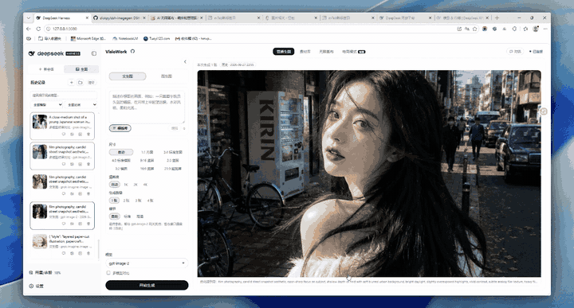
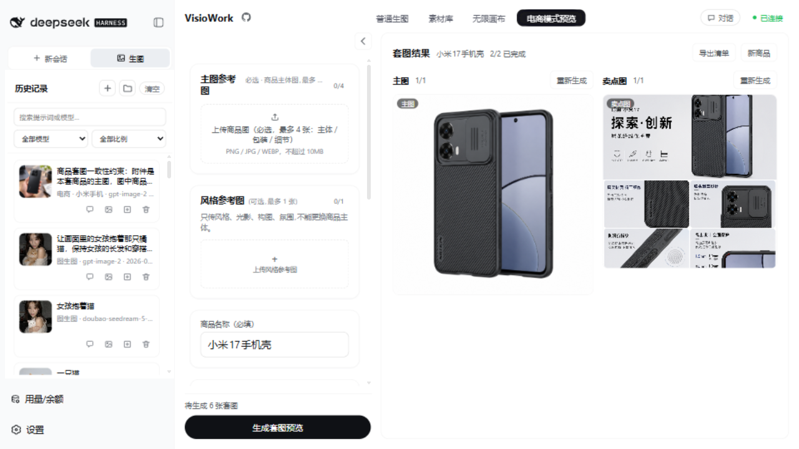
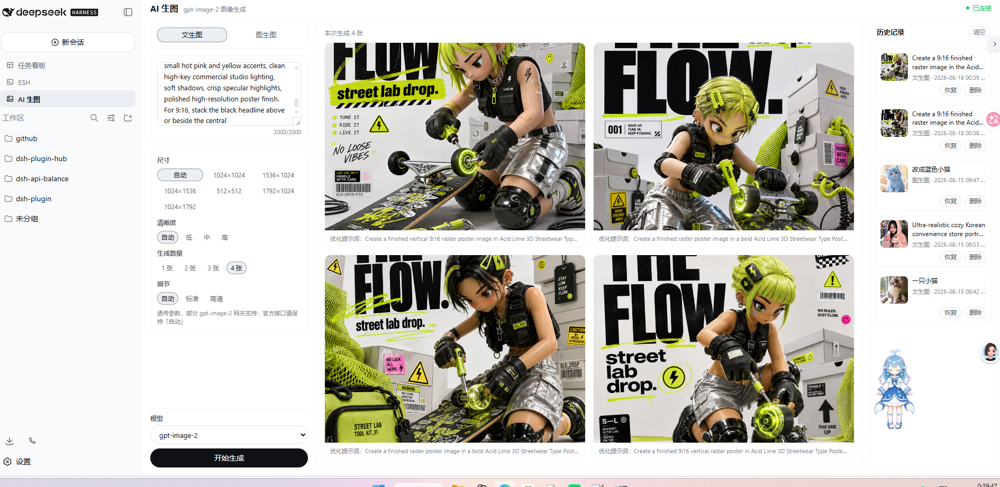
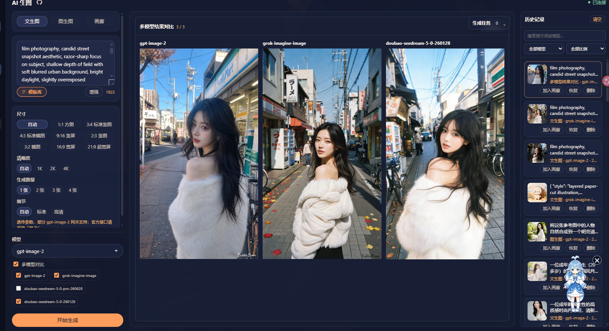
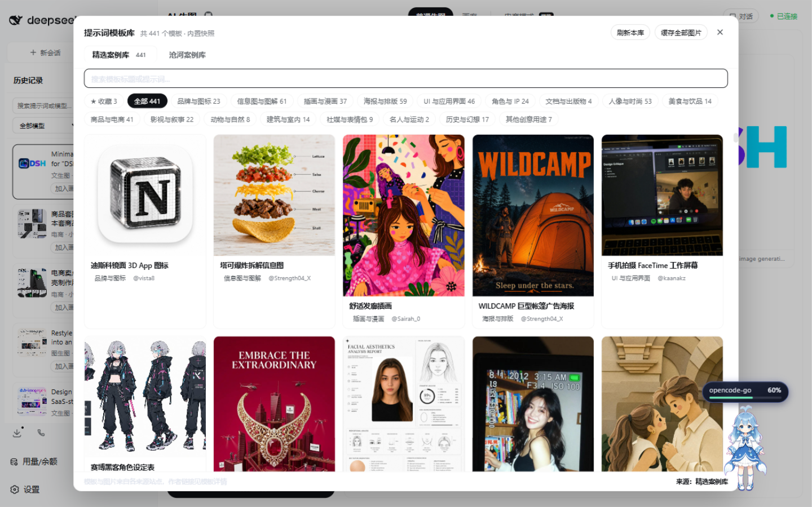
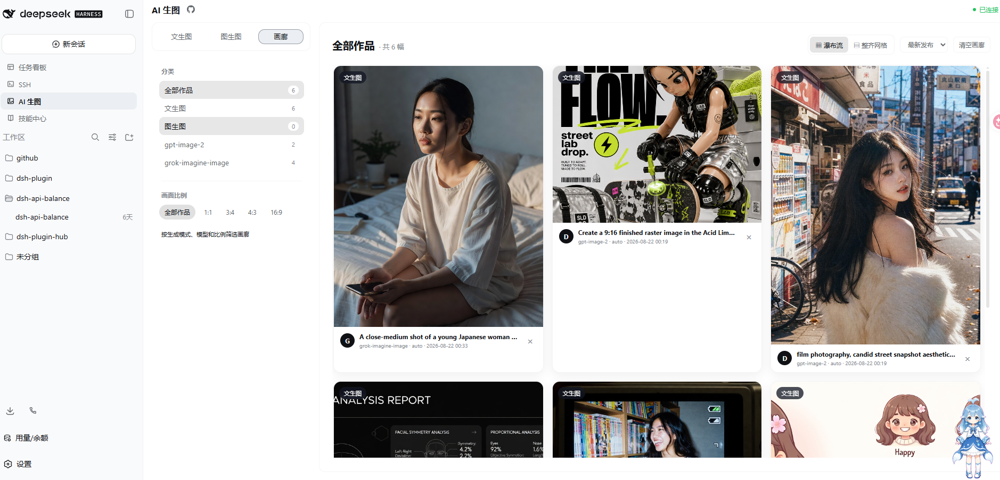
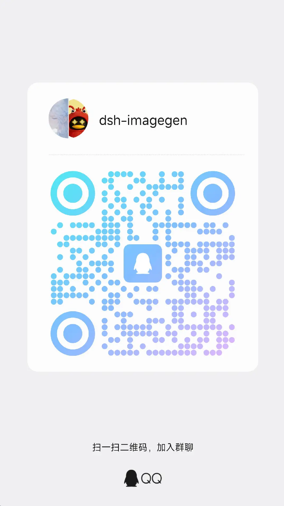

# dsh-imagegen

<div align="center">
  <a href="https://www.npmjs.com/package/@dickpy/dsh-imagegen"></a>
  &nbsp;
  <a href="https://www.npmjs.com/package/@dickpy/dsh-imagegen"></a>
  &nbsp;
  <a href="./LICENSE"></a>
  &nbsp;
  <a href="https://github.com/dickpy/dsh-imagegen"></a>

  <p><strong>在 DeepSeek Harness 里，生成、编辑、管理，一站完成。</strong></p>
  <p><strong>快速导航</strong></p>
  <p><a href="#quick-start">🚀 快速开始</a>　·　<a href="#canvas">无限画布</a>　·　<a href="#ecommerce">电商套图</a>　·　<a href="#txt2img">文生图 / 图生图</a>　·　<a href="#gallery">模板 / 画廊</a>　·　<a href="#configuration">模型配置</a>　·　<a href="#community">👥 QQ 交流群</a></p>
</div>

<a id="quick-start"></a>
## 快速开始

需要已安装 [DeepSeek Harness](https://github.com/deepseek-ai/DeepSeek-Harness) 和 Node.js 20+。

```bash
dsh plugin --profile web add @dickpy/dsh-imagegen
```

安装后重启 `dsh web`，侧边栏会出现「生图」入口。到「设置 → 生图配置」添加提供方、填写 API 地址与密钥、检测并选择生图模型，保存后即可开始创作。Windows 若遇 PowerShell 脚本策略限制，请使用 `dsh.cmd`。

<details>
<summary><b>其他安装方式、升级与回滚</b></summary>

- **让 Agent 安装：**把上面的安装命令发给 DSH、Codex 或其他 coding agent。
- **指定版本：**使用 `@dickpy/dsh-imagegen@<版本号>`，或从 [GitHub Releases](https://github.com/dickpy/dsh-imagegen/releases) 下载 tgz 后安装。
- **升级：**重复执行 `add` 命令；插件也会在面板中提示新版本。更新后重启 `dsh web`。
- 渠道配置、历史记录和画廊数据保存在 DSH 宿主侧，正常升级不会清空。

</details>

<a id="features"></a>
## 核心功能

| 能力 | 用途 |
| --- | --- |
| **无限画布** | 把提示词、参考图和生成节点连成可迭代的创作流程。 |
| **电商套图** | 从商品参考图生成主图、卖点图、场景图等成套素材。 |
| **文生图 / 图生图** | 使用兼容的生图渠道生成、编辑并比较图片。 |
| **对话与 Agent** | 在 DSH 对话中生成图片、继续编辑，并把结果带回会话。 |
| **画廊与历史** | 管理创作结果、模板与标签；在不同设备上接续创作。 |

<a id="canvas"></a>

把文字、图片和生成配置连起来；从历史或画廊加入素材，再继续生成和迭代。

<div align="center">
  
</div>

<details>
<summary><b>画布、文件节点与技能细节</b></summary>

- 支持图片、文本、生成配置和文件节点；图片节点可标注、移除背景或拆分图层。
- 单个文件最大 50MB；可在画布内预览常见文档、表格、PDF、图片与音视频。
- 内置文本润色、图片描述、内容抽取和图片转可编辑 PPT 等技能；图片转 PPT 不需要另外安装第三方技能或配置 OCR token。
- 图片转 PPT 使用配置的聊天模型理解版式，在本地生成可编辑文字与基础矢量形状；复杂照片或插画可能会简化。
- 也可安装和管理外部技能。重任务技能会启动具有本机文件读写与命令执行能力的无头 Agent；运行前请检查技能来源和权限。
- 旧版第三方 `image-to-editable-ppt` 可继续用于独立 Agent 工作流；它不参与内置图片转 PPT，相关 OCR 或图片后端配置也不是内置流程的前置条件。
- 技能配置格式与安全边界见 [`docs/skill-config.md`](docs/skill-config.md)。

</details>

<a id="ecommerce"></a>

从商品主体和可选风格参考出发，先预览套图计划、逐张调整提示词，再批量生成；主图可作为其他用途图片的一致性参考。

<div align="center">
  
</div>

<a id="txt2img"></a>

输入提示词即可生成，也可上传参考图进行编辑；支持多张结果、比例与清晰度设置、任务队列、历史恢复和全屏预览。

<div align="center">
  
</div>

在 DSH 对话里可让 Agent 调用生图；用 `/edit_image` 描述修改内容，也可从工作台或画廊把图片加入当前会话继续编辑。

#### 多模型对比

同一提示词可提交给多个模型并列查看结果，便于快速挑选风格与质量。

<div align="center">
  
</div>

<a id="gallery"></a>

提示词模板库内置精选案例、沧河、手绘、Prompt/Signal 与 GPT Image 2 五个来源，可搜索、筛选、收藏并直接带入生图。生成结果可在画廊中用标签和收藏继续整理。

<p align="center">
  
  
</p>

<a id="configuration"></a>
## 模型配置

在「设置 → 生图配置」添加渠道，填写 API 地址与密钥，检测并选择生图模型。可配置多个提供方，并设置默认生图模型和可选的提示词增强聊天模型。

支持 OpenAI 兼容的 Images API / Chat Completions，以及 xAI Grok、Google Nano Banana、Seedream、Qwen-Image、GLM-Image、MiniMax 等预置渠道；也可手动添加兼容模型。

<details>
<summary><b>接口与渠道补充说明</b></summary>

- 通用渠道默认自动判断 Images API 与 Chat Completions；也可在设置中手动指定。
- One-API、New API、LiteLLM 等只暴露 `/chat/completions` 的网关，可填写完整接口地址并选择对应模型。
- API 密钥保存在 DSH 宿主设置中；未被自动识别的兼容模型可手动添加。
- 不同服务商的图生图、尺寸与返回格式可能不同，请确认所选模型实际支持的能力。

</details>

<a id="security"></a>
## 数据与安全

- API 请求经 DSH 宿主转发；密钥保存在本机设置中，不直接暴露给浏览器。
- 历史、画廊、画布和图片保存在 DSH 数据目录 `~/.dsh/dsh-imagegen/`，由你控制。
- 生图与图生图会把提示词或参考图发送给所配置的上游服务；请按服务商政策处理敏感内容。
- 内置轻量技能会把所选内容发送给配置的聊天模型。图片转 PPT 的 PPTX 在本地生成，由原生文字与基础矢量形状组成，不会把整张原图直接铺成幻灯片背景；结果需人工检查。
- 外部重任务技能可能读写本机文件并执行命令；运行前请确认技能可信、输入内容可共享。
- 生图会消耗上游 API 额度；请人工检查生成结果。不要把 API 密钥贴到 Issue、日志或截图中。

<a id="community"></a>
## QQ 交流群与支持

欢迎加入 QQ 群，一起交流 DSH、AI 生图与插件使用，也欢迎分享提示词、工作流和改进建议。

<p align="center">
  
</p>

- [Bug 报告](https://github.com/dickpy/dsh-imagegen/issues/new?template=bug_report.yml) · [功能建议](https://github.com/dickpy/dsh-imagegen/issues/new?template=feature_request.yml)
- [查看所有 Issues](https://github.com/dickpy/dsh-imagegen/issues) · [GitHub Releases](https://github.com/dickpy/dsh-imagegen/releases)
- 如果这个插件对你有帮助，欢迎给项目点个 Star。

<details>
<summary><b>本地开发</b></summary>

```bash
pnpm run typecheck
pnpm run build
pnpm run watch
node scripts/smoke.mjs
```

本地打包并安装到 DSH 验收：

```bash
pnpm pack --pack-destination .
dsh plugin --profile web add ./dickpy-dsh-imagegen-<版本>.tgz
```

</details>

## 许可证

[Apache-2.0](./LICENSE)

内置模板所引用的第三方项目与许可见 [THIRD_PARTY_NOTICES.md](./THIRD_PARTY_NOTICES.md)。
